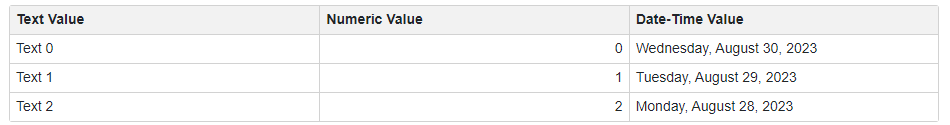

<!-- default badges list -->

<!-- default badges end -->
# Blazor Grid - Bind to a DataTable object

You can bind a **DxGrid** component to a **DataTable** object. Generate such an object and pass it directly to the Grid's [Data](https://docs.devexpress.com/Blazor/DevExpress.Blazor.DxGrid.Data) property.

<!-- default file list -->
## Files to look at

* [Index.razor](./CS/BindToDataTable/Pages/Index.razor)
<!-- default file list end -->

## Documentation

* [Grid - Data Binding](https://docs.devexpress.com/Blazor/403737/components/grid/bind-to-data)
* [Bind Components to Data with EF Core](https://docs.devexpress.com/Blazor/403167/common-concepts/data-binding/bind-components-to-data-with-entity-framework-core)

## More Examples

* [Grid - Bind to Web API Service](https://github.com/DevExpress-Examples/blazor-DxGrid-Bind-To-Web-Api-Service)
