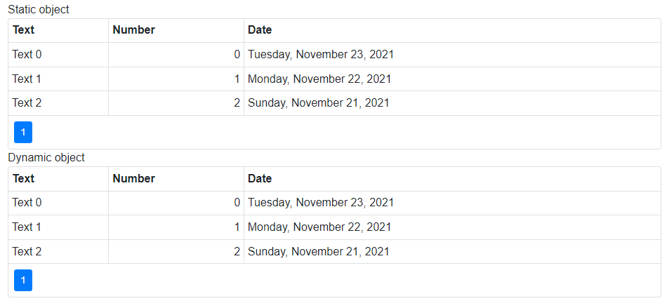

<!-- default badges list -->

<!-- default badges end -->

# Blazor DataGrid - Bind a grid to a DataTable object

The Data Grid was moved to maintenance support mode. No new features/capabilities will be added to this component. We recommend that you [migrate](https://docs.devexpress.com/Blazor/403162/grid/migrate-from-data-grid-to-grid) to the [Grid](https://docs.devexpress.com/Blazor/403143/grid) component. 

You can bind the **DxDataGrid** component to the IEnumerable collection of objects. That is why you cannot pass a DataTable object directly to the Data Grid's [Data](https://docs.devexpress.com/Blazor/DevExpress.Blazor.DxDataGrid-1.Data) property. 

However, when you know the structure of the DataTable object, you can create a class with corresponding properties for each column in the DataTable object. After that you need to generate the IEnumerable collection of this class' objects based on the *Rows* collection of the DataTable object. 
This approach is demonstrated in the first "Static object" grid.

When the DataTable object is generated dynamically, its structure is unknown. In this case, you can bind the **DxDataGrid** component to the IEnumerable collection of the [ExpandoObject](https://docs.microsoft.com/en-us/dotnet/api/system.dynamic.expandoobject?view=netframework-4.8) objects. This collection allows you to dynamically generate properties based on the structure of the DataTable. The "Dynamic object" grid demonstrates this approach. The [ConvertDataTableToExpandoObjectList](./CS/DataGridBindingToDataTable/Pages/Index.razor#L66) method converts the DataTable object to the IEnumerable collection of the ExpandoObject objects.

<!-- default file list -->
## Files to look at

* [Index.razor](./CS/DataGridBindingToDataTable/Pages/Index.razor)
<!-- default file list end -->

## Documentation

* [Data Grid - Data Binding](http://docs.devexpress.devx/Blazor/DevExpress.Blazor.DxDataGrid-1.Data)
* [Bind Components to Data with EF Core](https://docs.devexpress.com/Blazor/403167/common-concepts/bind-data-grid-to-data-from-entity-framework-core)

## More Examples

* [Data Grid - Bind to Web API Service](https://github.com/DevExpress-Examples/blazor-DxDataGrid-Bind-To-Web-Api-Service)
